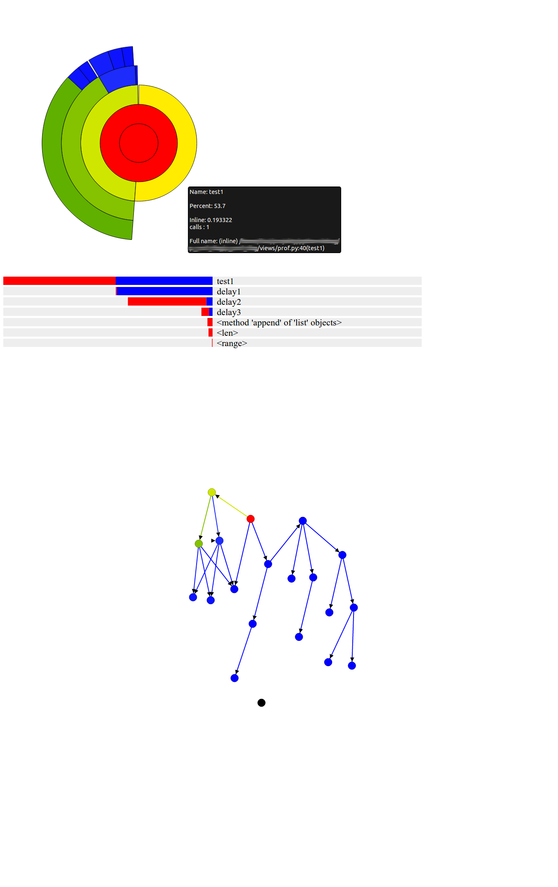

## Django Visual Pofiling

Django profiling middleware with visual representation

### Features


* Hierarchical pie chart
    * Zoomable
    * Information about inline timing

* Stacked Bar chart
    * Cumulative timing
    * Inline timing

* Call tree

### How to use

#### To enable

In settings:

```
PROFILER=True

MIDDLEWARE_CLASSES += 'django_vis_profiling.cp_middleware.cProfileMiddleware'

INSTALLED_APPS += 'django_vis_profiling'
```

#### To use

* Visual repesentation

http://url/view/?profile_graph=1

* Plain text

http://url/view/?profile=1&profile_sort=cumtime

* Binary file

http://url/view/?profilebin=1

### Screenshot



